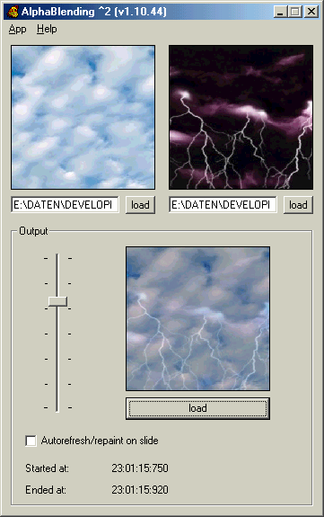



## AlphaBlending ^2

### Description

This sample shows how to do an AlphaBlending effect with one simple API call (only a few lines of code). The VB application access to an C++ DLL (C++ code included).
 
### More Info
 

             |
---                |---
**Submitted On**   |2001-10-09 23:01:08
**By**             |[mmanson](https://github.com/Planet-Source-Code/PSCIndex/blob/master/ByAuthor/mmanson.md)
**Level**          |Advanced
**User Rating**    |5.0 (10 globes from 2 users)
**Compatibility**  |VB 6\.0
**Category**       |[Graphics](https://github.com/Planet-Source-Code/PSCIndex/blob/master/ByCategory/graphics__1-46.md)
**World**          |[Visual Basic](https://github.com/Planet-Source-Code/PSCIndex/blob/master/ByWorld/visual-basic.md)
**Archive File**   |[AlphaBlend282401092001\.zip](https://github.com/Planet-Source-Code/mmanson-alphablending-2__1-27946/archive/master.zip)

